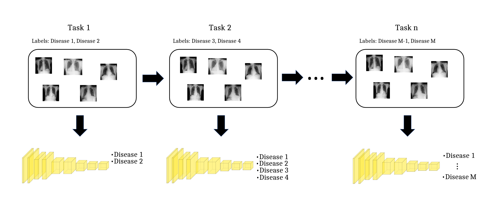
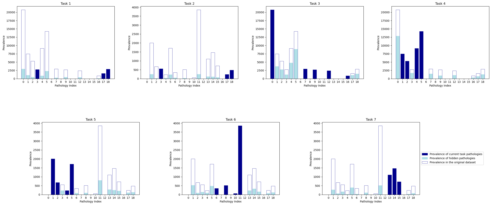
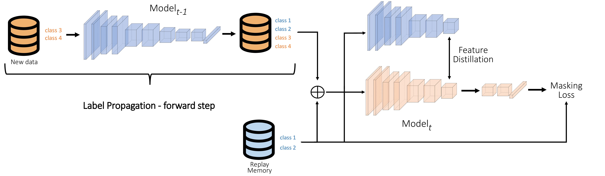
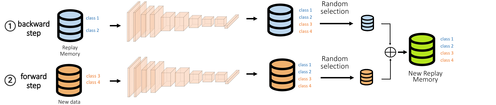
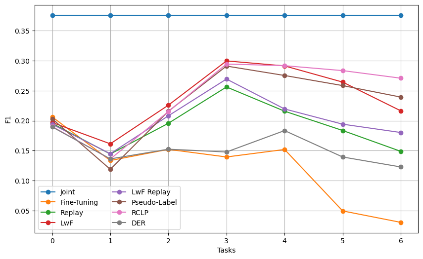

# Replay Consolidation with Label Propagation (RCLP) for the NIC scenario in the Medical Domain

<div align="center">

<div align="left">
  
* **NIC Scenario**: Implementation of the New Instances and New Classes (NIC) scenario for the medical domain.
* **Replay Consolidation with Label Propagation (RCLP)**: Implementation of a new Continual Learning (CL) method that minimizes forgetting.
****

# Introduction
<div align="center">

<div align="left">
We implement the NIC scenario in the medical domain considering the problem of pathology classification of Chest X-ray images.
In particular, we consider a scenario of 7 tasks, for a total of 19 pathologies, such that between two successive tasks either a domain shift occurs or new classes are introduced. The scenario is implemented using the CheXpert (CXP) and ChestXray14 (NIH) datasets.

Each task is associated with all and only the samples in which at least one of the relative pathologies appears. 

The plots represented above show the prevalence of each disease in each task. The dark blue line is associated to the prevalence of the pathologies in the original dataset. The dark blue bars represent the occurrence of the pathologies associated to the relative task, while the light blue lines represent the prevalence of the other - hidden - pathologies. As highlighted by the figure, there is some intersection between tasks, hence some samples are in common.

Moreover, we propose and implement a new method to overcome the limitations of traditional CL strategies in this scenario:
- Replay-based methods perform poorly due to the interference between replayed samples and new samples.
- Distillation-based methods require the re-appearance of old labels in new images.

<div align="center">

<div align="left">

<div align="center">

<div align="left">
The advantages of our approach, called Replay Consolidation with Label Propagation, are threefold: (1) the integration of old knowledge on the new task samples and of new knowledge on the replay buffer samples, together with a Masking Loss, mitigate the issue of task interference of Replay; (2) the Replay memory is optimized since the targets provide information not only on the labels from their originating tasks but also from all preceding tasks up to the current one; (3) by replaying samples that contain old classes, the limitations of distillation are overcome.

For more details, please refer to our [paper](#https://arxiv.org/abs/2404.06859)

## Results
<div align="center">

<div align="left">

We benchmarked the traditional CL methods and our novel method RCLP on a NIC scenario in the medical domain.
We found that our approach outperforms existing methods in terms of forgetting and final F1 score.

## Training execution
To run our code, the download of the NIH and CXP datasets is necessary. The datasets can be downloaded respectively from https://stanfordmlgroup.github.io/competitions/chexpert/ and https://paperswithcode.com/dataset/chestx-ray14.

The folder "models" is empty; however, when running the script of each method, the models resulting from training on each task are saved in this folder in the form 'models/{method}_{taskID}_{epoch}.pth'.

The folder "indices" is empty as well. After running the code, it will contain .txt files with the sample indices relative to each task.

In the src folder, a script for each method is present. To execute each method, the first thing that needs to be done is run "python Create_scenarios.py". This code creates the division of the NIH and CXP datasets in tasks and saves the indices of the samples in each task in .txt files in the folder "indices". At this point, any method can be executed by running "python {method}.py". The code reads the indices from the corresponding .txt file and creates the task stream, then computes the corresponding strategy.

During the training, the training loss is printed every 100 mini-batches and the validation loss is printed after each epoch. The evaluation of the resulting models is then computed on all the test sets relative to the old tasks and the current one, and the corresponding values of AUC and F1 score are printed.

The folders data, training, and eval contain scripts in which auxiliary functions, needed for training using each strategy, are defined.

****

## Citation

If you find this project useful in your research, please add a star and cite us 😊 

```BibTeX
@misc{ceccon2024multilabelcontinuallearningmedical,
      title={Multi-Label Continual Learning for the Medical Domain: A Novel Benchmark}, 
      author={Marina Ceccon and Davide Dalle Pezze and Alessandro Fabris and Gian Antonio Susto},
      year={2024},
      eprint={2404.06859},
      archivePrefix={arXiv},
      primaryClass={cs.CV},
      url={https://arxiv.org/abs/2404.06859}, 
}
```

